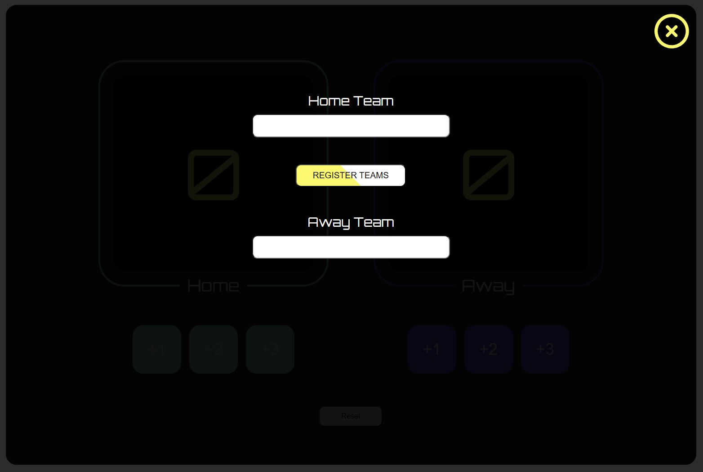
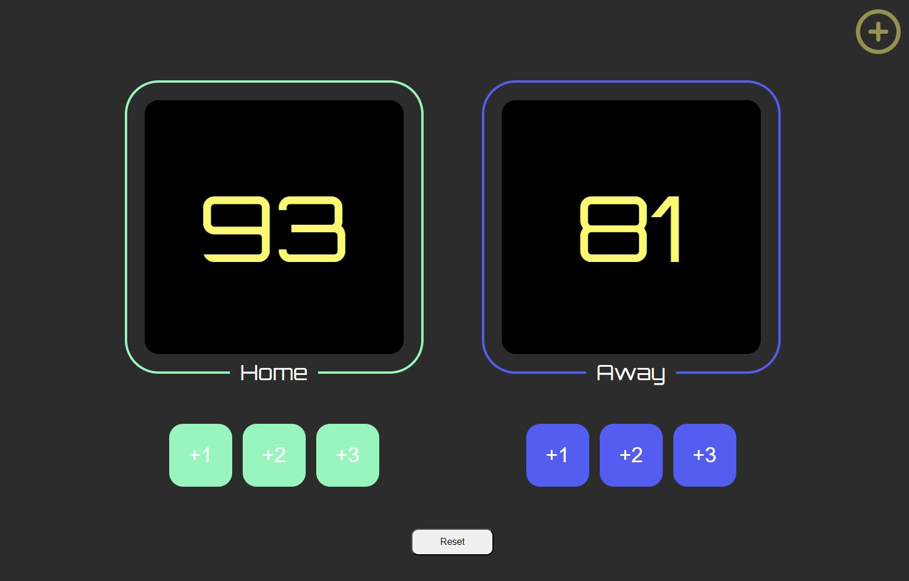

# Score Keeper – JavaScript-Projekt

## Beschreibung

Dieses JavaScript-Projekt wurde im Rahmen eines Coding-Bootcamps bei supercode.de erstellt. Es handelt sich um einen "Score Keeper", der es ermöglicht, den aktuellen Spielstand eines Basketballspiels anzuzeigen.

### Die Anwendung bietet die Möglichkeit, die folgenden Aktionen durchzuführen:

- Vorab Teamnamen über input-Felder in einem Overlay einzugeben
- 1, 2 oder 3 Punkte für das jeweilige Team hochzuzählen
- Den Spielstand über einen Reset-Button wieder auf 0 zu setzen

## Tools/Technologien
- HTML5
- CSS3
- Vanilla JavaScript

## Figma Vorlage
Die Figma Vorlage findest du hier: [Figma Vorlage](https://www.figma.com/file/0qudyIFTSjtWhhaf6ZHJuC/js_einfuehrung_projects_level_1_4-(Copy)?type=design&node-id=0-1&mode=design&t=YJFhuYy7JJ73Kih1-0)

## Screenshots

### Overlay - Score Keeper

### Spielstand - Score Keeper

## GitHub Live Vorschau

Du findest eine Live Vorschau auf GitHub: [GitHub Live Vorschau](https://w1tch3r-code.github.io/arrow_functions/js_project_score_keeper)

## GitHub Repository

Du findest das gesamte Projekt auf GitHub: [GitHub Repository](https://github.com/w1tch3r-code/arrow_functions/tree/main/js_project_score_keeper)

## Anmerkungen

- Dieses Projekt wurde im Rahmen eines Coding-Bootcamps bei supercode.de erstellt.
- Die Anwendung ermöglicht eine einfache und schnelle Spielstandsanzeige eines Basketballspiels samt Vergabe von Teamnamen.
- Die README.md-Datei dient auch als Bewerbungsunterlage und präsentiert meine Fähigkeiten in der Webentwicklung.
